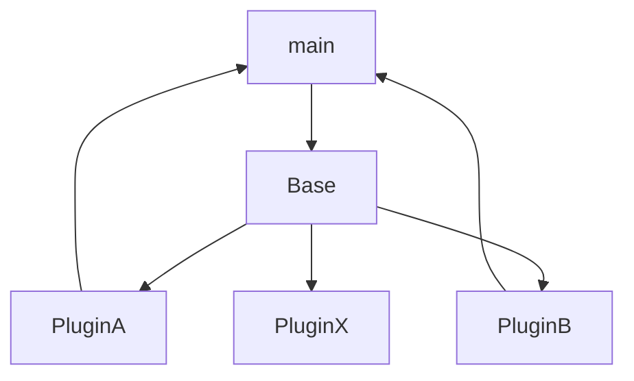

# pluginMocUp
Loads all Classes in the Plugin directory into a Main clas, that is able to call functions and get called by the 
plugins itself.
Project Moc-Up
Minial Plugin Example




## File structue
```
├── main.py
├── plugins
│   ├── __init__.py
│   ├── plugin_a.py
│   └── plugin_b.py
└── README.md

```

## Running
````
> python3 main.py
````


## Credits

Based on: https://gist.github.com/dorneanu/cce1cd6711969d581873a88e0257e312
