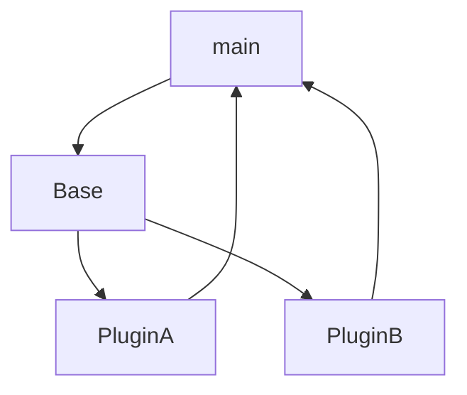

# pluginMocUp
Loads all Classes in the Plugin directory into a Main clas, that is able to call functions and get called by the 
plugins itself.
Project Moc-Up
Minial Plugin Example

Based on: https://gist.github.com/dorneanu/cce1cd6711969d581873a88e0257e312




##Running
````
> python3 main.py
````